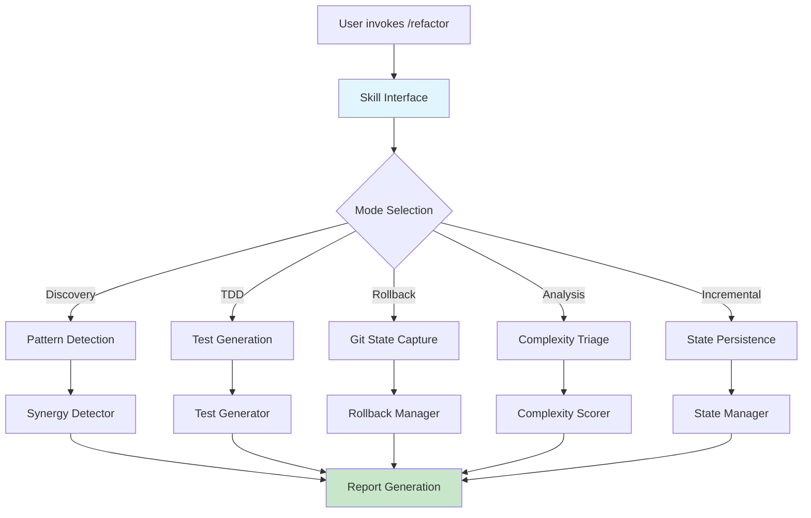

# refactor

> Multi-file refactoring orchestrator with TDD enforcement, constitutional filtering, and agent coordination

[](https://github.com/EndUser123/refactor/actions) [](https://github.com/EndUser123/refactor) [](https://opensource.org/licenses/MIT)

## 📺 Assets & Media

Architecture diagrams are available in the [assets/](./assets/) directory:

- **Architecture Diagram**: See [assets/diagrams/architecture.md](./assets/diagrams/architecture.md) for system design overview with 7-step workflow
- **Integration Guide**: Examples for integrating with /aid, /code-python, and /synergy skills

Note: Media assets are generated using NotebookLM and Claude Code's built-in diagramming tools.

## Overview

**refactor** is a Claude Code skill that orchestrates multi-file refactoring with Test-Driven Development discipline, constitutional filtering, and intelligent agent coordination.

### Key Features

- **7-Step Workflow**: Discovery → DEDUPLICATE → PRIORITIZE → CONSTITUTIONAL FILTER → RED → REFACTOR → REGRESSION
- **TDD Enforcement**: All refactoring follows RED → GREEN → REFACTOR cycle with characterization tests
- **Constitutional Filter**: SoloDevConstitutionalFilter validates changes against project constraints
- **Agent Coordination**: Parallel agents for bugs/logic, DRY/simplicity, and convention detection
- **Rollback Safety**: Git-based rollback automation with state persistence
- **Incremental Mode**: State management for long-running refactoring sessions

## Installation

### Claude Code Skill Installation

```bash
# Create junction for skill (Windows - recommended, no admin required)
mklink /J "P:\.claude\skills\refactor" "P:/packages/refactor/skill"

# Or use the provided installation script
cd P:/packages/refactor
scripts\install-dev.bat
```

### Development Installation

```bash
cd P:/packages/refactor

# Install in development mode
pip install -e ".[dev,test]"

# Install pre-commit hooks
pre-commit install
```

## Quick Start

### Basic Usage

```bash
# Invoke from Claude Code
/refactor

# Discovery mode (analyze codebase)
/refactor --mode discovery

# TDD mode (with test generation)
/refactor --mode tdd

# Incremental mode (state persistence)
/refactor --mode incremental
```

### Python API

```python
from refactor import (
    ComplexityScore,
    ComplexityTriage,
    RefactorConfig,
    RefactorState,
    RollbackManager,
    StateManager,
    TestGenerator,
    create_rollback_plan,
    detect_synergy,
    get_config,
)

# Create configuration
config = get_config()

# Analyze complexity
triage = ComplexityTriage()
score = triage.analyze_file("path/to/file.py")

# Create rollback plan
rollback = create_rollback_plan(base_commit="main")

# Generate tests
generator = TestGenerator()
tests = generator.generate_characterization_tests(["file1.py", "file2.py"])
```

## Workflow

### Step 1: Discovery Phase

Launch parallel agents for pattern detection:
- **Bugs/Logic Agent**: Detects potential bugs and logic errors
- **DRY/Simplicity Agent**: Identifies code duplication and complexity
- **Conventions Agent**: Finds violations of project conventions

### Step 2: DEDUPLICATE

Merge findings from multiple agents, removing duplicates and consolidating related issues.

### Step 3: PRIORITIZE

Aggregate findings by severity levels:
- **P0**: Critical bugs, security issues
- **P1**: High-priority refactoring opportunities
- **P2**: Medium-priority improvements
- **P3**: Low-priority optimizations

### Step 4: CONSTITUTIONAL FILTER

Apply SoloDevConstitutionalFilter to validate findings against:
- Solo-dev constraints (no enterprise patterns)
- Project-specific rules from CLAUDE.md
- Technical architecture boundaries

### Step 5: RED Phase

Create characterization tests for each finding:
- Capture current behavior
- Document edge cases
- Establish regression baseline

### Step 6: REFACTOR Phase

Apply changes with TDD discipline:
1. Write failing test (RED)
2. Implement fix (GREEN)
3. Clean up code (REFACTOR)
4. Verify tests pass

### Step 7: REGRESSION

Run full test suite to ensure no regressions:
- Unit tests
- Integration tests
- Characterization tests

## Architecture

### Component Overview



### Data Flow

```
User Request
    ↓
Load Config (CLI + YAML)
    ↓
Load State (incremental mode)
    ↓
Discovery (parallel agents)
    ↓
Deduplicate Findings
    ↓
Prioritize (P0→P3)
    ↓
Constitutional Filter
    ↓
TDD Cycle (RED → GREEN → REFACTOR)
    ↓
Regression Testing
    ↓
Save State
    ↓
Report to User
```

## Configuration

### CLI Options

```bash
/refactor [OPTIONS]

Options:
  --mode {discovery,tdd,rollback,analysis,incremental}
                      Refactoring mode (default: discovery)
  --config PATH       Path to configuration file (default: ~/.refactor.yaml)
  --output FORMAT     Output format: text, json, markdown (default: text)
  --severity LEVEL    Minimum severity: P0, P1, P2, P3 (default: P1)
  --state-file PATH   State file for incremental mode (default: ~/.refactor-state.json)
  --dry-run           Show what would be done without making changes
  --verbose           Enable detailed output
```

### Configuration File

```yaml
# ~/.refactor.yaml
refactor:
  mode: discovery
  severity: P1
  output: markdown

  discovery:
    agents:
      - bugs_logic
      - dry_simplicity
      - conventions
    parallel: true

  tdd:
    test_framework: pytest
    coverage_threshold: 80
    characterization_tests: true

  rollback:
    enabled: true
    auto_commit: true
    state_file: ~/.refactor-state.json

  incremental:
    enabled: false
    checkpoint_interval: 300  # seconds

  constitutional:
    filter: SoloDevConstitutionalFilter
    strict_mode: false
```

## Output Artifacts

### Findings Report

Prioritized list of refactoring opportunities with:
- Severity level (P0-P3)
- File location and line numbers
- Description and impact
- Recommended action
- Estimated effort

### Test Files

Characterization tests for each finding:
- Test file name pattern: `test_refactor_<module>_<issue>.py`
- Captures current behavior
- Documents edge cases
- Establishes regression baseline

### Rollback Scripts

Git-based rollback automation:
- Commit hash for each change
- Rollback script for reverting
- State snapshot for recovery

### State Files

Incremental progress tracking:
- Completed tasks
- Pending work
- Blockers and decisions
- Resume capability

## Integration with Other Skills

### /aid

Single-file refactoring analysis:
```bash
/aid refactor:path/to/file.py
```

### /code-python

Python 2025 standards compliance:
```bash
/code-python --check
```

### /synergy

Cross-file pattern detection:
```bash
/synergy --detect-patterns
```

### /complexity

Code complexity analysis:
```bash
/complexity --threshold 15
```

## Development

### Running Tests

```bash
# Install development dependencies
pip install -e ".[dev,test]"

# Run tests
pytest tests/ -v

# Run with coverage
pytest --cov=refactor --cov-report=term-missing

# Run specific test
pytest tests/test_complexity_triage.py -v
```

### Code Quality

```bash
# Format code
ruff format src/ tests/

# Lint code
ruff check src/ tests/

# Type checking
mypy src/
```

## Troubleshooting

### Common Issues

**Issue: "Skill not found" error**
- **Cause**: Junction not created correctly
- **Fix**: Run `scripts\install-dev.bat` as administrator

**Issue: "Tests failing after refactor"**
- **Cause**: Characterization tests not capturing all behavior
- **Fix**: Run `/refactor --mode tdd` to regenerate tests

**Issue: "Rollback failed"**
- **Cause**: Git state changed during refactoring
- **Fix**: Run `git reflog` to find rollback commit

## Contributing

Contributions welcome! Please see [CONTRIBUTING.md](CONTRIBUTING.md) for guidelines.

## License

MIT License - see [LICENSE](LICENSE) for details.

## Links

- **Homepage**: https://github.com/EndUser123/refactor
- **Repository**: https://github.com/EndUser123/refactor
- **Issues**: https://github.com/EndUser123/refactor/issues

## Requirements

- [Claude Code](https://claude.ai/code) - AI-assisted development
- [Python 3.12+](https://www.python.org/) - Type hints, dataclasses, pathlib
- [pytest](https://docs.pytest.org/) - Testing framework
- [ruff](https://github.com/astral-sh/ruff) - Linting and formatting

---

**Version**: 1.0.0
**Status**: Production Ready ✅
