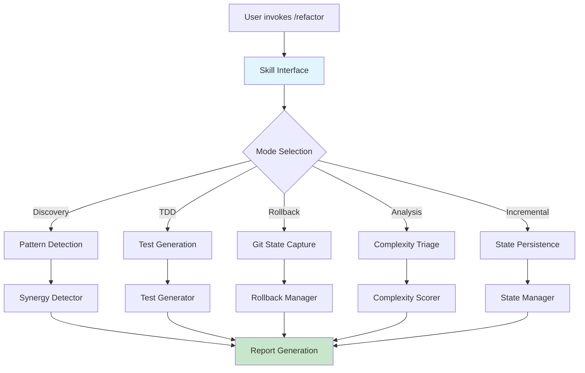

# Refactor Skill Architecture Diagram



## Component Details

### Input Sources
- **User Invocation**: `/refactor` command with optional flags
- **File System**: Source code files for analysis
- **Git History**: Commit history for rollback points

### Processing Pipeline
1. **Discovery Phase**: Launch parallel agents for bugs/logic, DRY/simplicity, conventions
2. **DEDUPLICATE**: Merge findings from multiple agents
3. **PRIORITIZE**: Aggregate by P0→P3 severity levels
4. **CONSTITUTIONAL FILTER**: Apply SoloDevConstitutionalFilter
5. **RED PHASE**: Create characterization tests
6. **REFACTOR**: Apply changes with TDD discipline
7. **REGRESSION**: Run full test suite

### Output Artifacts
- **Findings Report**: Prioritized list of refactoring opportunities
- **Test Files**: Characterization tests for each finding
- **Rollback Scripts**: Git-based rollback automation
- **State Files**: Incremental progress tracking

## Data Flow

```
User Request
    ↓
Load Config (CLI + YAML)
    ↓
Load State (incremental mode)
    ↓
Discovery (parallel agents)
    ↓
Deduplicate Findings
    ↓
Prioritize (P0→P3)
    ↓
Constitutional Filter
    ↓
TDD Cycle (RED → GREEN → REFACTOR)
    ↓
Regression Testing
    ↓
Save State
    ↓
Report to User
```

## Integration Points

- **/aid**: Single-file refactoring analysis
- **/code-python**: Python 2025 standards compliance
- **/complexity**: Code complexity analysis
- **/synergy**: Cross-file pattern detection
- **/tdd**: Test-driven development workflow
